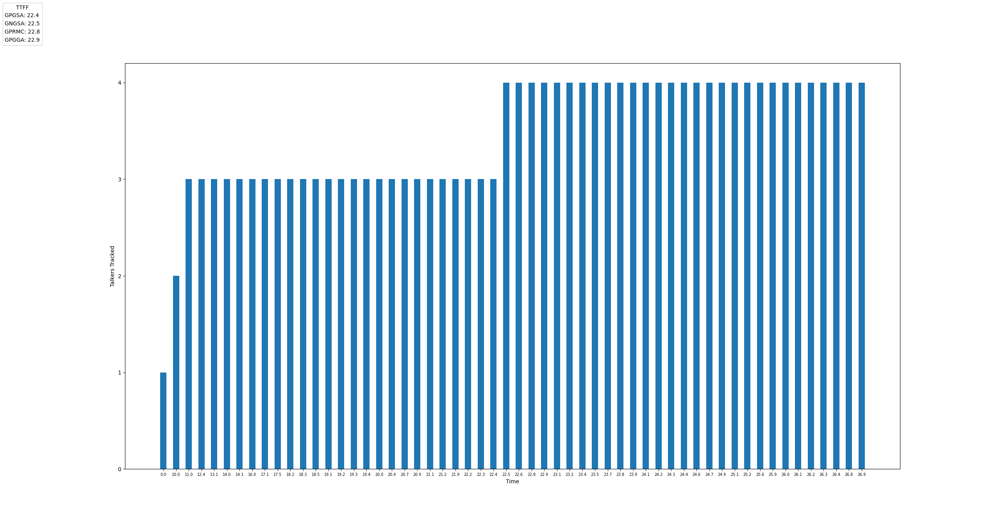
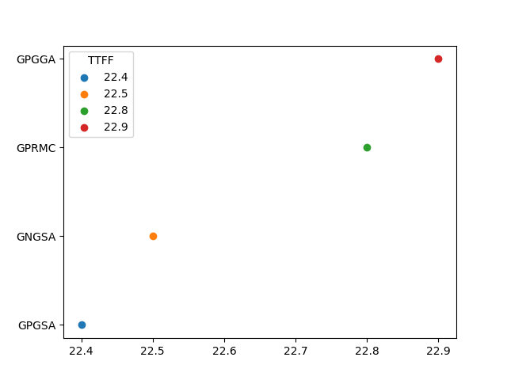

**Background/Problem Statement:**
```
We’re developing a product that has a GPS receiver. As part of our testing we’ve collected logs
of NMEA output. An example output log is shown below. The t=n indicates timestamp in
seconds for the given NMEA string.
```
&nbsp;
Deliverable 1:
```
Write a program that parses this output and provides a plot showing the number of satellites
tracked as a function of time and outputs time to first fix (TTFF). You’re welcome to use any
programming language you’re comfortable with, but note that we use Python.
```
&nbsp;
Deliverable 2:
```
This stream of NMEA sentences comes in over UART at 9600N1. How would you think about
writing a program that parses a live stream of NMEA data? What modules would you use?
How would you determine the start/end of a GPS scan?
```
**How to run:**

1. Checkout this repo and `cd` to the root folder

2. Install dependencies from requirements.txt:
```pip3 install -r requirements.txt```
   
3. For deliverable 1, run script via: 
```python3 nmea_parser/plotter.py```
   



*Optional:* <br />
I have also included a method to display an TTFF scatter plot. It is currently disabled, but I left it :
